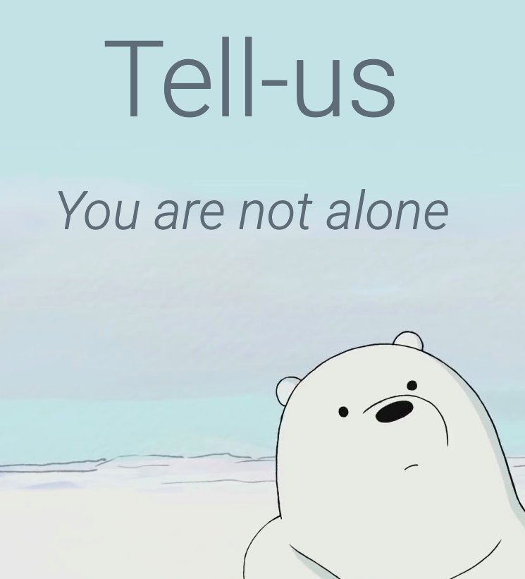

# Feeling Blue? Tell-Us


## About:
### The project is a submission for ConUHacks 2020 hosted by HackConcordia. 

## Description:

According to Canadian Mental Health Association, 49% of people who went through anxiety and depression have never seen a doctor. This application will help the user find a diagnosis and will locate the nearest institution that will provide professional help.

## Requirements:
* PHP
* \>= python3
* pip 

To install the required pip modules:

```
pip3 install -r requirement.txt
```

## Note:
The project comes in 2 versions: one with Python as a logic processor, and TkInder for the platform. The other version is a web using Php to communicate with JavaScript on the front-end, and do the logic process.

## Contributors:
+ Duc Nguyen
+ Minh Tran
+ Krishna Dube
+ Andres Daniel Oros Halas
